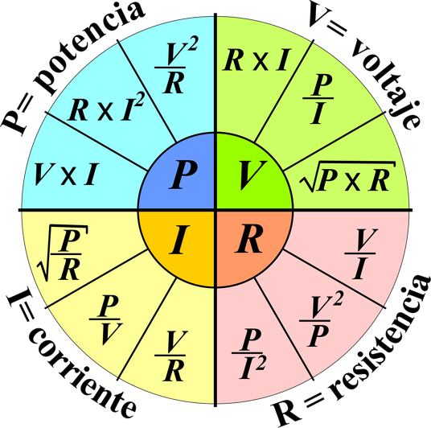
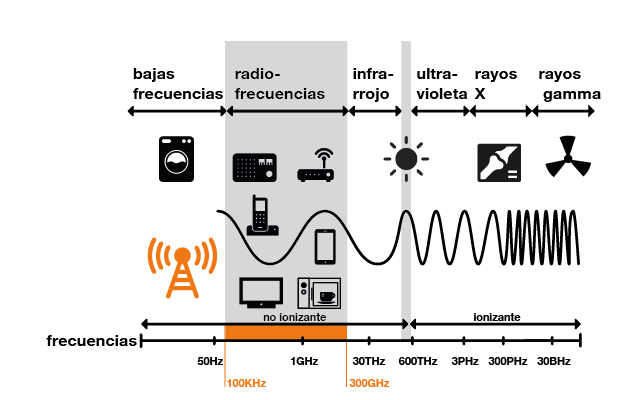
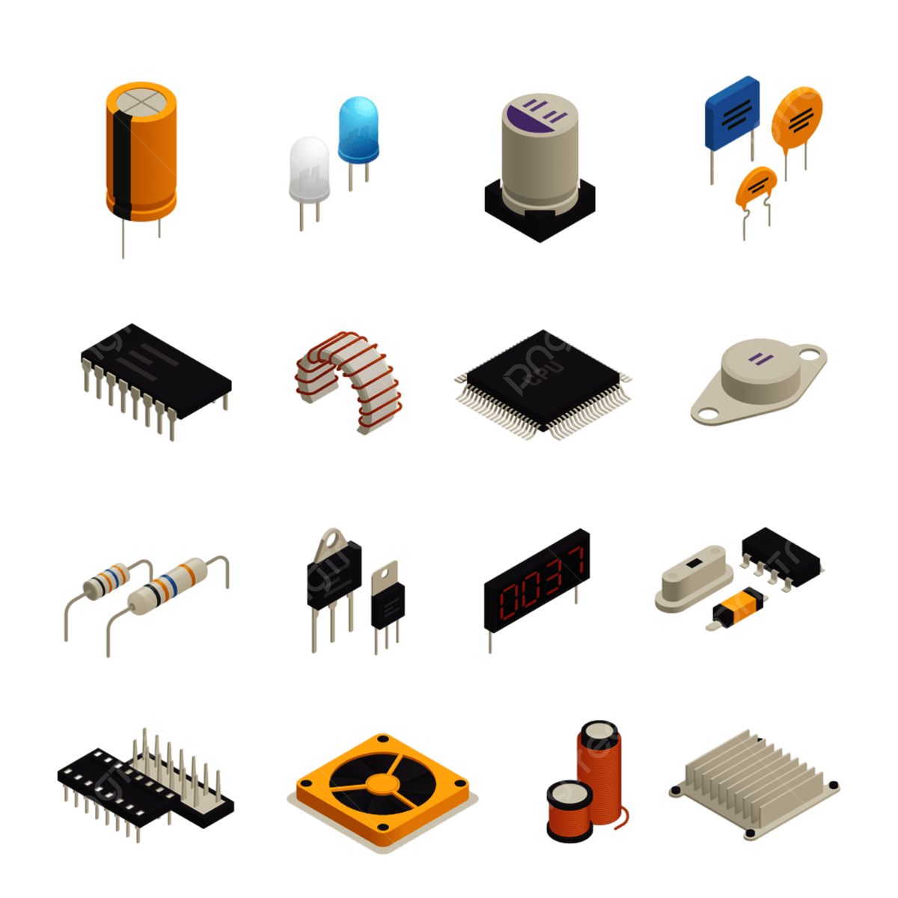

<!DOCTYPE html>
<html lang="es">
<head>
    <meta charset="UTF-8">
    <meta name="viewport" content="width=device-width, initial-scale=1.0">
    <title>ElectroNet: Innovación y Conexión</title>
    <link rel="stylesheet" href="styles.css">
    <link href="https://fonts.googleapis.com/css2?family=Roboto:wght@400;700&display=swap" rel="stylesheet">
    <link rel="stylesheet" href="https://cdnjs.cloudflare.com/ajax/libs/font-awesome/6.0.0-beta3/css/all.min.css">
    
    
</head>
<body>
    <header>
        <h1>ElectroNet: Innovación y Conexión</h1>
        <nav>
            <ul>
                <li><a href="#inicio">Inicio</a></li>
                <li><a href="#articulos">Artículos</a></li>
                <li><a href="#sobre-nosotros">Sobre Nosotros</a></li>
                <li><a href="#contacto">Contacto</a></li>
            </ul>
        </nav>
    </header>
    <main>
        <section id="inicio">   
            <h2>Bienvenido a Nuestro Blog</h2>
            
Este es un espacio dedicado a compartir conocimientos sobre ingeniería electrónica y telecomunicaciones.

            
        </section>
        <section id="articulos">
            <h2>Últimos Artículos</h2>
            <article>
                <h3>Introducción a los Circuitos Eléctricos</h3>
                
Los circuitos eléctricos son la base de cualquier sistema electrónico. En este artículo, exploramos los conceptos básicos...

                
            </article>
            <article>
                <h3>Telecomunicaciones: Un Vistazo al Futuro</h3>
                
La tecnología de telecomunicaciones está en constante evolución. Descubre las tendencias y avances más recientes...

                
            </article>
             <article>
                <h3>Historia y Evolución de los Semiconductores</h3>
                
La electrónica moderna ha experimentado una evolución impresionante desde los primeros días de los tubos de vacío hasta los avanzados semiconductores de hoy. Los materiales semiconductores, como el silicio y el germanio, han sido fundamentales en el desarrollo de dispositivos electrónicos que forman la base de casi todos los sistemas electrónicos actuales.

                
            </article>
            <!-- Anuncio de AdSense -->
            <ins class="adsbygoogle"
                 style="display:block"
                 data-ad-client="ca-pub-xxxxxxxxxx"
                 data-ad-slot="1234567890"
                 data-ad-format="auto"></ins>
            
        </section>
        <section id="sobre-nosotros">
            <h2>Sobre Nosotros</h2>
            
Somos un equipo apasionado por la ingeniería electrónica y las telecomunicaciones. Nuestro objetivo es compartir conocimiento y mantenerse actualizado con las últimas tendencias y tecnologías en el campo. Aunque por el momento el equipo solo cuenta por una persona cursando aun la carrera, se que si formamos una comunidad podemos apoyarnos con material y aumentar nuestra productividad en la Carrera.

        </section>
        <section id="contacto">
            <h2>Contacto</h2>
            
Si tienes alguna pregunta o deseas ponerte en contacto con nosotros, por favor, completa el siguiente formulario:

            <form action="https://formspree.io/f/your-form-id" method="POST">
                <label for="name">Nombre:</label>
                <input type="text" id="name" name="name" required>
                <label for="email">Correo Electrónico:</label>
                <input type="email" id="email" name="email" required>
                <label for="message">Mensaje:</label>
                <textarea id="message" name="message" rows="5" required></textarea>
                <button type="submit">Enviar</button>
            </form>
        </section>
    </main>
    <footer>
        
&copy; 2024 ElectroNet: Innovación y Conexión

        

            <a href="https://www.instagram.com/lufabricioagurto/?hl=es" target="_blank"><i class="fab fa-instagram"></i></a>
            <a href="https://www.facebook.com/lufabricio.agurtocabezudo" target="_blank"><i class="fab fa-facebook"></i></a>
        

    </footer>
</body>
</html>
